# 📄 PDF 리포트 생성 시스템 아키텍처 (PDF Report System Architecture)

## 1. 개요 (Overview)
본 문서는 사용자의 포트폴리오를 분석하여 **실시간 데이터 기반의 투자 리포트(PDF)**를 생성하는 시스템의 아키텍처를 기술합니다.
이 시스템은 **Docker 컨테이너 환경**에서의 안정성을 최우선으로 설계되었으며, 크롤링, AI 분석, 시각화, PDF 렌더링이 하나의 파이프라인으로 통합되어 있습니다.

---

## 2. 시스템 구성도 (System Architecture)

```mermaid
sequenceDiagram
    participant User as 👤 사용자 (Frontend)
    participant API as 🚀 Backend API (FastAPI)
    participant Crawler as 🕸️ Data Crawler
    participant AI as 🧠 AI Analyst (GPT-4o)
    participant Gen as 📄 Report Generator (ReportLab)

    User->>API: POST /report/download
    Note right of User: "리포트 다운로드" 버튼 클릭

    rect rgb(30, 30, 35)
        Note right of API: [Step 1] 데이터 수집
        API->>Crawler: 재무 정보 요청 (yfinance)
        API->>Crawler: 뉴스 크롤링 (Google News RSS)
        Crawler-->>API: 정형/비정형 데이터 반환
    end

    rect rgb(40, 40, 50)
        Note right of API: [Step 2] AI 분석
        API->>AI: 포트폴리오 + 뉴스 데이터 전송
        AI-->>API: 투자 인사이트 & 리스크 분석 결과
    end

    rect rgb(50, 50, 60)
        Note right of API: [Step 3] PDF 생성
        API->>Gen: 데이터 및 분석 결과 전달
        Gen->>Gen: Matplotlib 차트 생성 (In-Memory)
        Gen->>Gen: ReportLab PDF 렌더링
        Gen-->>API: PDF Binary Stream 반환
    end

    API-->>User: File Download (Blob)
```

---

## 3. 핵심 컴포넌트 상세 (Core Components)

### 3.1 Frontend Layer (`PortfolioDashboard.tsx`)
- **역할**: 사용자 트리거 및 파일 다운로드 처리.
- **구현 방식**:
  - `fetch` API로 백엔드에 요청.
  - 응답받은 바이너리 데이터를 `Blob` 객체로 변환.
  - `window.URL.createObjectURL(blob)`을 사용하여 브라우저 메모리 상에 가상 URL 생성 후 다운로드 실행.

### 3.2 Backend API Layer (`portfolio.py`)
- **역할**: 전체 파이프라인 오케스트레이션.
- **엔드포인트**: `POST /portfolio/report/download`
- **특징**: `StreamingResponse`를 사용하여 생성된 PDF 바이트 스트림을 클라이언트로 직접 전송 (디스크 저장 안 함).

### 3.3 Data Layer
#### A. Data Crawler (`crawler.py`)
- **재무 데이터**: `yfinance` 라이브러리를 사용하여 PER, PBR, 매출 추이 등 핵심 지표 수집.
- **뉴스 데이터**: `requests` + `BeautifulSoup`을 사용하여 Google News RSS 피드 파싱.
- **안정성 확보**: `html.parser`를 사용하여 C 라이브러리(`lxml`) 의존성 문제 해결.

#### B. AI Analyst (`rag.py`)
- **모델**: OpenAI `GPT-4o`.
- **로직**: 수집된 재무/뉴스 데이터를 프롬프트 컨텍스트에 포함시켜 종합적인 투자 의견 생성.

### 3.4 Presentation Layer (`report_generator.py`)
이 시스템에서 가장 기술적 난이도가 높았던 부분으로, **OS 의존성을 제거**하는 방향으로 설계되었습니다.

- **PDF Engine**: **`ReportLab` (Platypus)**
  - *이전 시도*: `WeasyPrint` (HTML -> PDF 변환)
  - *문제점*: Docker(Linux Slim) 환경에서 `Pango`, `Cairo` 등 시스템 라이브러리 설치가 매우 까다롭고 오류가 빈번함.
  - *해결책*: 순수 Python 라이브러리인 `ReportLab`으로 교체하여 **어떤 OS/환경에서도 동작**하도록 변경.
  
- **Charting**: **`Matplotlib`**
  - *설정*: `matplotlib.use('Agg')` 필수 적용.
  - *이유*: 서버(Docker)에는 디스플레이 장치(GUI)가 없으므로, 시각화 생성 시 백엔드를 Non-interactive 모드로 설정해야 함.

---

## 4. 트러블슈팅 및 설계 원칙 (Design Decisions)

| 이슈 (Issue) | 원인 (Cause) | 결정된 해결책 (Decision) |
|---|---|---|
| **500 Error (Chart)** | 서버 환경에서 GUI 호출 (`plt.show()`) 불가 | `Agg` 백엔드 사용으로 메모리기반 렌더링 전환 |
| **Build Failure** | `WeasyPrint`의 무거운 시스템 의존성 | 경량화된 `ReportLab`으로 라이브러리 교체 |
| **XML Parsing Error** | `lxml` 설치 실패 (C 컴파일 필요) | Python 내장 `html.parser` 사용 |
| **Frontend 404** | Docker 볼륨 동기화 지연 | 컨테이너 재빌드 프로세스 정립 |

## 5. 향후 개선 계획 (Future Improvements)
1.  **한글 폰트 지원**: 현재 `ReportLab` 기본 폰트(Helvetica) 사용으로 한글이 지원되지 않음. `.ttf` 폰트 파일(예: 나눔고딕)을 컨테이너에 포함시키고 로드하는 로직 추가 필요.
2.  **비동기 알림**: 리포트 생성 시간이 10초 이상 소요되므로, "생성 완료 시 이메일 발송" 옵션 추가 고려.
